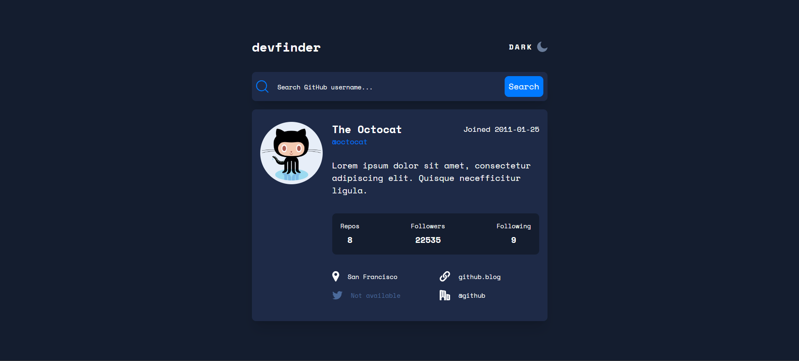
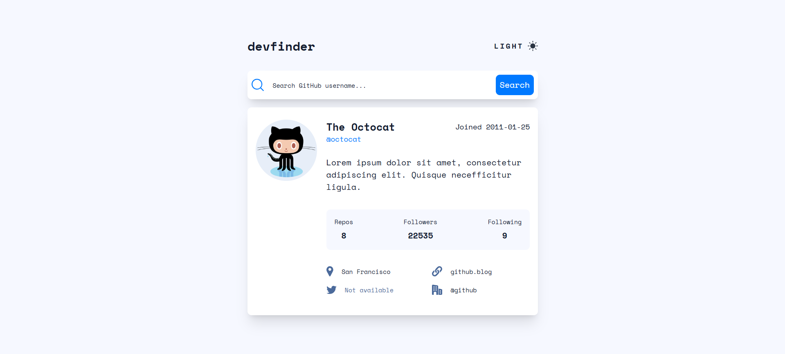

# 🔍 GitHub User Search App (DevFinder)

A modern and responsive **GitHub user search application** built using **React + Vite**.
Search any GitHub username and instantly view profile details in a clean UI.

---

## 🚀 Live Demo

👉 https://msadafk.github.io/github-user-search-app/

---

## 📂 GitHub Repository

👉 https://github.com/MsadafK/github-user-search-app

---

## 🖼️ Screens Preview

### 🌙 Dark Mode



---

### ☀️ Light Mode



---

## 📌 Overview

This project is a **GitHub user finder tool** that fetches real-time data from the **GitHub API** and displays it in a structured format.

It focuses on:

* Clean UI/UX
* API integration
* State management
* Theme switching

---

## ✨ Features

* 🔍 Search GitHub users by username
* 🌙 Light / Dark mode toggle
* 📊 Display user details:

  * Avatar
  * Name & username
  * Bio
  * Repositories
  * Followers / Following
  * Location, website, company
* ⚠️ Handles "User not found" errors
* 📱 Fully responsive design

---

## 🛠️ Tech Stack

* React 19
* Vite
* CSS
* GitHub REST API

---

## 🔗 API Used

```id="2f9xpa"
https://api.github.com/users/{username}
```

---

## 📂 Project Structure

```id="7czxj1"
github-user-search-app/
├── public/
│   ├── dark-mode.png
│   ├── light-mode.png
│
├── src/
│   ├── components/
│   │   ├── DevFinder.jsx
│   │   ├── Header.jsx
│   │   ├── SearchBar.jsx
│   │   ├── UserCard.jsx
│   │   └── DevFinderProvider.jsx
│   │
│   ├── assets/
│   ├── App.jsx
│   └── main.jsx
│
├── index.html
└── package.json
```

---

## ⚙️ Installation & Setup

```bash id="l4x3gm"
git clone https://github.com/MsadafK/github-user-search-app.git
cd github-user-search-app
npm install
npm run dev
```

---

## 📈 What I Learned

* Working with **REST APIs (async/await, fetch)**
* Managing **state in React**
* Implementing **theme toggle (dark/light)**
* Structuring reusable components
* Handling edge cases like **invalid usernames**

---

## 🔮 Future Improvements

* Add loading skeleton UI
* Add search history
* Improve animations
* Add keyboard accessibility

---

## 👨‍💻 Author

**Mohd Sadaf**
Frontend Developer

* [](https://github.com/MsadafK)
* [](https://www.linkedin.com/in/mohd-sadaf/)

---

## ⭐ If you like this project

Give it a ⭐ on GitHub — it helps a lot!

---

## 📬 Feedback

If you have suggestions or improvements, feel free to open an issue or connect!
