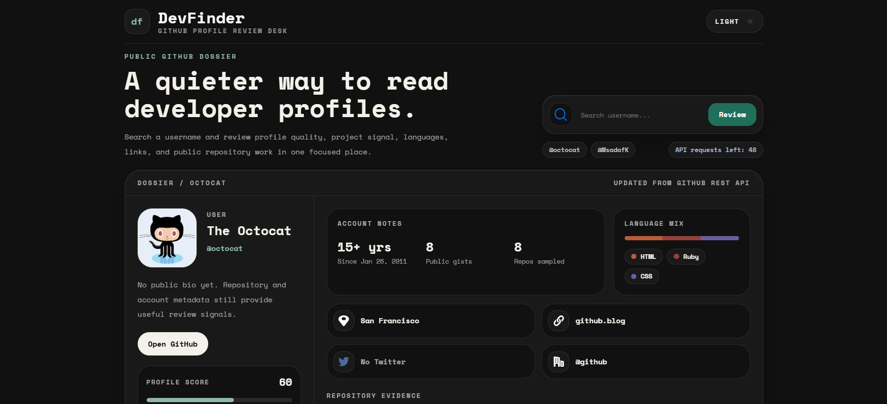

# DevFinder - GitHub Profile Review Desk

DevFinder is a portfolio-ready GitHub profile search app built with React, Vite, and Tailwind CSS. It turns any public GitHub username into a clean profile dossier with identity details, account signals, repository evidence, language mix, useful links, recent searches, and light/dark mode.



## Live Demo

https://msadafk.github.io/devfinder/

## Highlights

- Search any public GitHub username using the GitHub REST API
- Review a profile in a dossier-style layout instead of a basic card UI
- View account notes such as account age, public gists, and sampled repos
- See profile score based on bio, location, website, company, and social data
- Explore language mix from recent public repositories
- Inspect notable repositories sorted by stars with forks and update dates
- Use recent search history saved in local storage
- Switch between responsive light and dark themes with saved preference
- Works cleanly across mobile, tablet, and desktop screen sizes

## Tech Stack

- React 19
- Vite
- Tailwind CSS 4
- GitHub REST API
- Local Storage

## API Endpoints

```txt
https://api.github.com/users/{username}
https://api.github.com/users/{username}/repos?sort=updated&per_page=8
```

## Getting Started

```bash
git clone https://github.com/MsadafK/devfinder.git
cd devfinder
npm install
npm run dev
```

## Available Scripts

```bash
npm run dev
npm run lint
npm run build
npm run preview
```

## What This Project Demonstrates

- Fetching and combining real API data from multiple endpoints
- Managing loading, error, success, theme, and search-history states
- Building a responsive React interface that adapts down to small phones
- Designing a restrained portfolio UI that feels hand-crafted, not template-like
- Persisting user preferences with local storage
- Presenting data through reusable components and accessible controls

## Author

Mohd Sadaf  
Frontend Developer

- GitHub: https://github.com/MsadafK
- LinkedIn: https://www.linkedin.com/in/mohd-sadaf/
